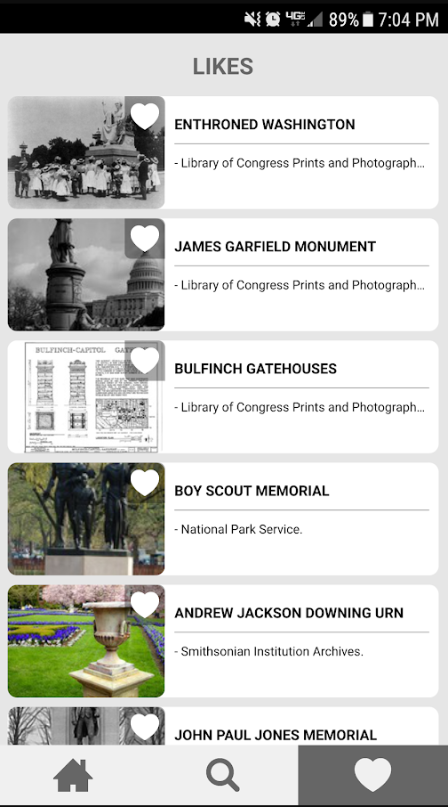

# omeka-everywhere/Mobile

1. Overview of the application

	-Vertical scroll browsing on the home feed.
	
	
	
	-Item exploration (pan/zoom images, playback video/audio, slideshow, metadata)
	
	
		
	-Local storage of liked items (either directly or through heist plugin)
	
	
		
	-Settings (layout, site list, heist pairing)
	
	
	
2. Requirements

	-Environment Setup
	
		Qt 5.5.1 MSVC2013 64bit
		Android for armeabi-v7a(GCC 4.9, Qt 5.5.1 for Android armv72) (for deploying Android)
	 
	-Omeka REST API(http://omeka.readthedocs.io/en/latest/Reference/api/). API must be set to public on targeted site.
	
	-heist plugins(https://omeka.org/classic/docs/Plugins/Heist/).

3. Build Instructions

	-How to build the OmekaMobile.
	1. Pull the latest build from Github.
	2. Open build from Qt Creator.
	3. Select Qt 5.5.1 MSVC2013 64bit build kit for iOS device or select Android for armeabi-v7a(GCC 4.9, Qt 5.5.1 for Android armv72) for Android device.
	4. Make sure the build is set to release mode, select Build in the toolbar, then select Rebuild Project "OmekaMobile".
	5. Deployment for Android device (http://doc.qt.io/qt-5/deployment-android.html)
	   Deployment for iOS device (http://doc.qt.io/qt-5/ios-support.html)
	
4. Configuration and Customization

	-endpoint
	
	Locate at Mobile/OmekaMobile/qml/clients/HeistClient.qml
	
	property url endpoint: "http://dev.omeka.org/mallcopy/" ( you can change this to any supported endpoint)
	
	-Heist plugin (site must have the plugin installed to use but mobile does not have to target same endpoint as table in order to accept content from that table)

	-The location of key files in the project structures.
	
	Styling(OmekaMobile/utils/Style.qml)
	
	ui assets(OmekaMobile/ui/)
	
	-Here is the tutorial of QML.(http://doc.qt.io/qt-5/qml-tutorial.html)
		
		

