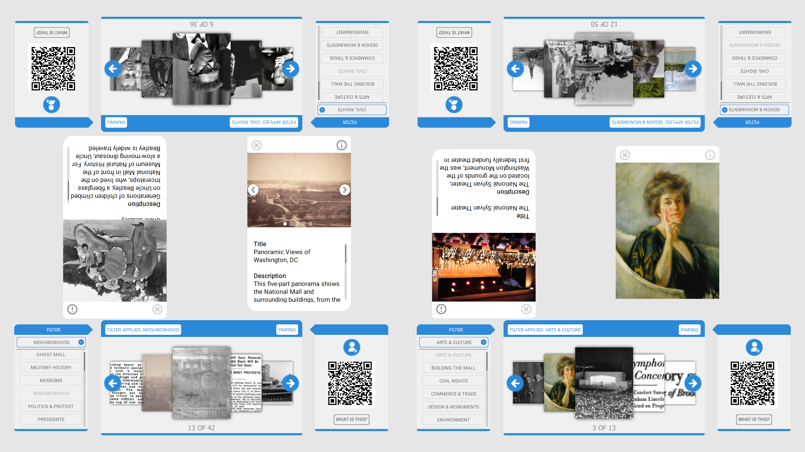

# omeka-everywhere

Omeka Everywhere&mdash;developed by [Open Exhibits](http://openexhibits.org)&mdash;is a tool which allows an institution to connect an Omeka Classic instance to a multitouch table or device. The Omeka Everywhere Collection Viewer uses the Omeka API to pull a chosen repository into an interactive experience without having to re-create any metadata. 

The Omeka Everywhere mobile app uses the Omeka API to connect to online collections. Institutions can modify the Omeka Everywhere source code and easily create mobile apps that connect to their online collections. 

App users can interact with collection items through sorting by keywords, zooming in on images, and from a learn more option that displays information on the flipside of each item. Users may also save favorites from the collection as they browse.

Omeka Everywhere is for museums, historical societies, special collections libraries, and anyone who is interested in extending their Omeka online collection to mobile users. In addition, the mobile application can be paired with a multitouch table or touch wall experience. This unique feature allows in-gallery visitors to view and seamlessly share collection items from the table instance to their personal devices.

To learn more about Omeka and how to set up a repository, visit [omeka.org](http://omeka.org/). The Omeka Everywhere collaboration between [Ideum](http://ideum.com), the Roy Rosenzweig Center for History and New Media at George Mason University, and the University of Connecticut is made possible by an IMLS grant.

Please visit the [Open Exhibits forum](http://forums.openexhibits.org/) for support for the Omeka Everywhere Collection Viewer. For support on Omeka repositories, visit the [forum](http://omeka.org/forums/) at omeka.org.

SUPPORTED OPERATING SYSTEMS
- Windows 7
- Windows 8
- Windows 10

ASSOCIATED LANGUAGES
- ActionScript 3
- QML
- C++

REQUIRED ENVIRONMENTS
- Adobe Flash Player 11+ (for the first version of Table app)
- Qt 5.9.2 MSVC2013 64bit kit(for Table2 app)
- Qt 5.5.1 MSVC2013 64bit kit(for Mobile app)
- Android for armeabi-v7a (GCC 4.9, Qt 5.5.1 for Android armv73) (for Android deployment)
- Latest iOS and XCode(for iOS deployment)

DOCUMENTATION
- Please see README file in each app folder
