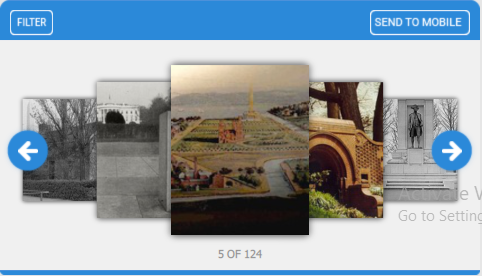
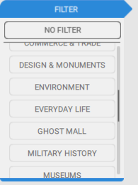
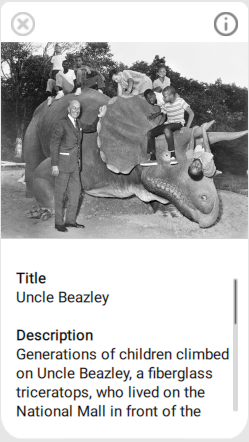

# omeka-everywhere/Table2

1. Requirements

	-Environment Setup
	
	 Qt 5.9.2 MSVC2013 64bit kit
	 
	-Omeka REST API(http://omeka.readthedocs.io/en/latest/Reference/api/). API must be set to public on targeted site.
	
	-heist plugins(https://omeka.org/classic/docs/Plugins/Heist/).

2. Build Instructions

	-How to build the OmekaTable2.
	1. Pull the latest build from Github.
	2. Open build from Qt Creator.
	3. Select Qt 5.9.2 MSVC2013 64bit build kit.
	4. Make sure the build is set to release mode, select Build in the toolbar, then select Rebuild Project "OmekaTable2".
	5. Qt Quick Deployment using windeployqt.exe.
	
	 	a)Open the command prompt.
		
	 	b)Navigate to the Qt install’s 'bin' folder (cf. “Application Location”) .
		
	 	c)Run the following command:
		
			> windeployqt.exe    --qmldir    APP_QML_DIR    APP_BINARY_DIR
	
	-Get the exe.
	
	Locate the release folder from your build directory ( e.g. Builds/release), which contains the compiled binary and it's dependencies.
	
3. User Guide
	
	-Configuration
	
	1. Locate build folder(eg. Table2/OmekaTable2). Open settings.js. 
	
		var USERS = 4(# of users. By default, it's 4. It can only be changed to 2 or 4 or 6).
		
		var OMEKA_ENDPOINT = "http://dev.omeka.org/mallcopy/" (Displaying endpoint. It can be changed to any supported endpoint.)
		
	2. User console browsing/filtering.
	
		the table2 app allows user to browse the collection. Like following image:
		
		
		
		the table2 app allows user to filter based on the keyword. Like following image:
		
		
		
	3. Content viewers and metadata.
	
		
		
	4. Generating a heist session.
	
		

4. Customization

	-The location of key files in the project structures.
	
	Styling(OmekaTable2/Style.qml)
	
	ui assets(OmekaTable2/content/)
	
	endpoint editing(OmekaTable2/settings.js)
	
	-Here is the tutorial of QML.(http://doc.qt.io/qt-5/qml-tutorial.html)
		
		

